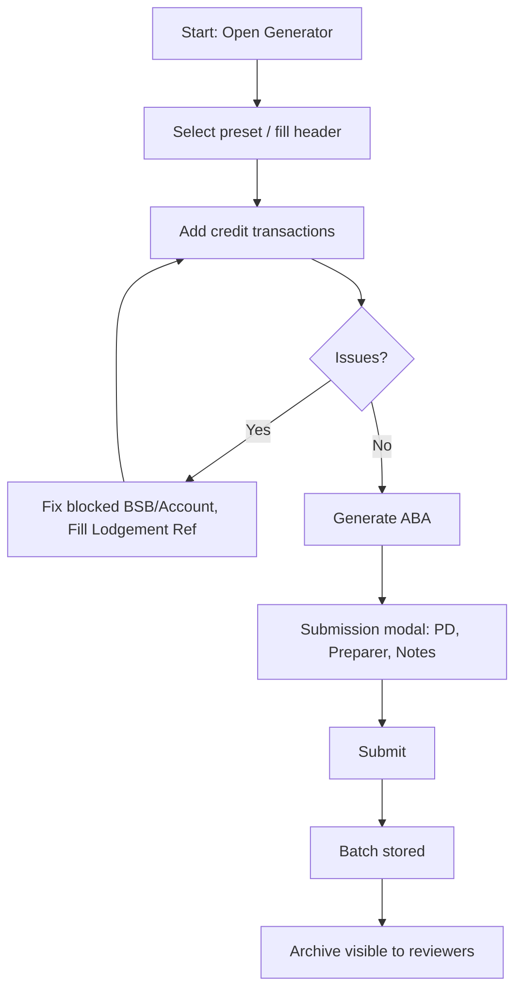
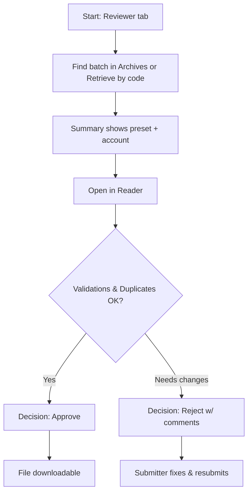
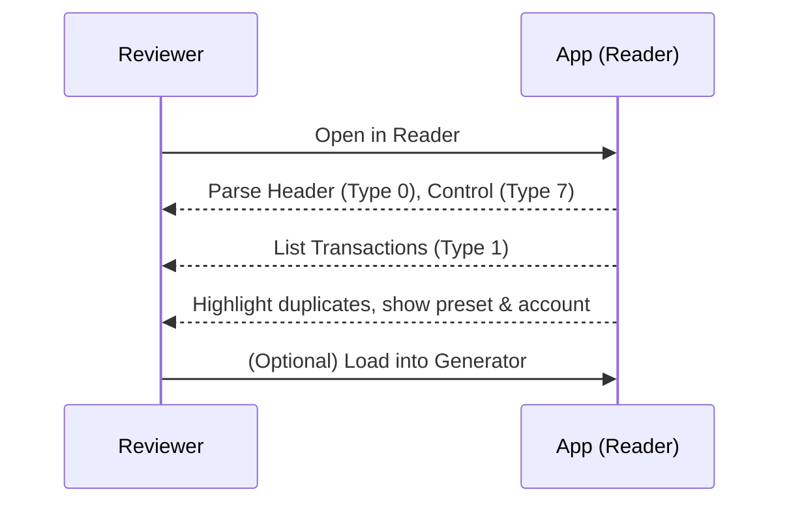

# Process Flows

This page diagrams the typical flows for Submitters (Users) and Reviewers.

> Note: These are Mermaid diagrams. In VS Code, use Markdown Preview to render; optionally install a Mermaid preview extension.

## Submitter flow

## Reviewer flow

## Reader inspection (detail)

