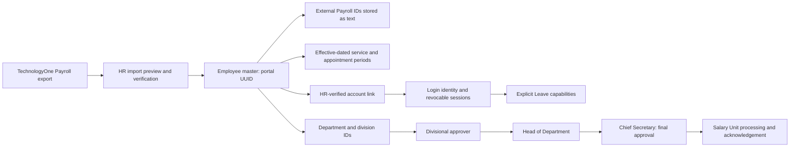

# Government Leave — Package 1 structure and 2,000-employee rollout

**Date:** 6 October 2026; updated 7 October. **Status:** Packages 1A, 1B and 1C implemented locally; government rollout is not enabled. The owner has checked Package 1B and confirmed it works. Package 1C awaits local review.

This implements the first structural slice of [the build backlog](GOVERNMENT-LEAVE-BUILD-BACKLOG-2026-10-06.md). TechnologyOne Leave is deferred for 6–12 months. TechnologyOne Payroll supplies employee references; the portal will own leave records during the gap. Ordinary recreation uses the owner's three-month choice; temporary recreation retains its separate twelve-month rule. This slice stores appointment facts without changing entitlement calculations.

## Structure and account design

Use one PostgreSQL database with separate employee, appointment, identity, organisation and approval records. An employee can exist without a login. Passwords and sessions belong to the account, never to Payroll IDs or the employee master. Keep existing UUIDs and accounts. The auth table's historical name, `reviewers`, does not restrict its capacity or purpose; renaming it would add migration work without increasing capacity.

Existing staff accounts retain their current access. New employee accounts have `account_type='employee'`, role `user`, and explicitly granted `hr_access` and `hr_leave_apply`. They receive no finance defaults, and server authentication rejects access to other modules through older any-login/role gates. Heads can receive an explicit leave-approval grant without becoming portal administrators. Officeholder assignment and capability grant are separate: both must be valid.

The current authentication contract uses a unique email address. The new provisioning API also requires one and generates a unique temporary password, forces replacement, and returns it only once to authorised HR/portal administration. It sends no email. This is an initial controlled provisioning mechanism; the bulk invitation/activation interface is still to build. Confirm individual email coverage. For staff without an accessible individual email, add a separate Payroll-ID login alias with a personal password or an approved identity-provider route; avoid fabricated/shared email addresses. Payroll ID identifies an account and is never proof of ownership or a password.

## Implemented in this slice

| Area | Structure and behaviour |
| --- | --- |
| Employee master | Retains `hr_employees.id`, historical leave and existing links. Adds stable department/division references alongside legacy text fields. Managed Staff edits populate the references; HR can verify older placements explicitly. |
| External IDs | `hr_employee_external_ids` stores exact text under `techone_payroll`, including leading zeros and letters. An ID cannot belong to two employees. One employee may retain several IDs after reappointment. Repeating the same verified ID is safe. No names are used to merge identities. |
| Service history | `hr_employee_service_periods` records dated employment category, teacher/intern flags, appointment reference, work pattern and nullable service-credit determination. Overlapping periods are rejected under an employee lock. Closing a period preserves history and allows the next appointment. No category or historical credit is guessed. |
| Work patterns | HR can create verified weekly patterns with weekdays and optional daily hours. Create a new pattern when schedules change to preserve historical references. No unapproved schedule/hours are seeded; roster calculations follow in Package 2. |
| Account linking | `hr_employee_account_links` retains verifier, reason, previous/current account and time. Central HR confirms links, conflicts block, both affected accounts' sessions are revoked. Reading My Leave cannot create or claim a staff record by name. Existing links remain available for reconciliation. |
| Account provisioning | Requires verified Payroll ID, active staff record, central HR access **and** portal administration access. Inserts an employee-only account with two Leave grants, verifies its link, and commits identity/audit changes together. |
| Directory and management UI | Central HR's default Staff screen uses server pages of 50 employees, with department/status and missing-fact filters, name or exact Payroll ID search. It provides verified identity/account links, details, service periods and placement forms. Account/manager/officeholder selectors also use pages of 50. Profile responses omit remuneration. Historical tools, non-central legacy Staff and portal account administration retain their full-list APIs; those are not capacity acceptance for government rollout. |
| Enterprise authority | `hr_approval_assignments` binds division, department or government-wide Chief Secretary scope to an employee officeholder and effective dates. Overlapping primary appointments are blocked. Closing/replacing assignments retains the history. |
| Routing preview | Returns the three stages for a verified employee placement and chosen date. Missing/multiple assignments, revoked approval grants, inactive identities and self-approval block readiness. This endpoint does not decide an application. |
| Network capacity | HR's existing permission middleware now enforces a budget per authenticated account, replacing the general shared-IP budget for HR routes. Existing sign-in abuse protections remain. Session owner/expiry indexes are added. |
| Audit | Identity and authority writes include audit records in their transaction; an audit failure rolls back the change. Older operations retain their current audit behaviour. |

Service periods and authority appointments have inclusive end dates: close on 31 March and start the replacement on 1 April. Empty end dates mean an open period. Unknown or disputed credit remains `NULL`, for HR determination in Package 2.

The new configuration API is mounted under `/api/hr/directory`. List/profile/external-ID/organisation/service-period/account-link and approval-assignment routes require central HR. Account creation additionally requires portal administration. This does **not** complete departmental access control: current broad `hr_staff_manage` access must be converted before assigning departmental HR users.

## Enterprise approval contract

The owner specified the ordinary government workflow on 6 October:

1. Employee submits against their verified division and department.
2. The divisional approver acts first.
3. The Head of Department acts next.
4. Chief Secretary grants final approval.
5. Salary Unit processes the approved result and acknowledges payroll handling.

A reporting manager is not automatically the divisional approver or HOD. Assign an officeholder to a stable organisation ID and a dated term. Chief Secretary is government-wide. The current preview conservatively blocks an unassigned division, including an employee without a division, until an authorised route exception is defined. Do not silently skip a stage.

The staged execution engine is still to build. Until it exists, new employee-only accounts cannot submit through the legacy single-decision endpoint, and that endpoint cannot grant their leave. Existing local staff workflows remain in service. Account type is an interim separation; Package 3 must persist the policy regime and complete route snapshot on each request so that later unlinking or transferring an account cannot alter a submitted request's authority.

At submission, snapshot employee placement, policy version and required offices. Recheck officeholder/delegation authority at each decision; retain the deciding account and assignment. Transfers must not silently rewrite a pending route. Support return-for-correction, rejection, cancellation, sequential stage completion, substitutes for self-approval, acting appointments and bounded delegation. One stage's consent cannot post usage or produce the final approved PDF. Final grant must reserve/post once under transaction locks and generate the personnel-file snapshot. The existing Treasury-final wording must change with that engine.

This management hierarchy sits alongside the supplied policy's additional consent/grant requirements. DHRL must reconcile teacher discretion, event leave, Minister consent and other special routes with this operational chain. Do not treat the owner's hierarchy as an unqualified replacement of every statutory authority; configure additional required consents where authorised.

## Plan for 2,000 employees

Two thousand employee rows and two thousand registered identities are distinct from two thousand simultaneous requests. Preserve the current stack and measure on the intended server before sizing or changing it. Keep the database connection pool bounded; do not allocate a connection per employee. The current pool uses the library default. Configure a measured pool size and connection-acquisition timeout as operational work rather than raising connections speculatively.

| Workload | Planned acceptance exercise | Gate |
| --- | --- | --- |
| Population | 2,000 employees/accounts, realistic departments and divisions, histories, balances and documents | Identity uniqueness, full reconciliation, bounded API responses and no global fetch per login |
| Normal day | 100 concurrently active sessions reading My Leave, lists and calendar | On the agreed server, target p95 read latency below 500 ms, no avoidable errors; measure DB wait, CPU and memory |
| Busy period | 200 active sessions, 30 simultaneous submissions/decisions, realistic polling | Target p95 writes below 1 s; no duplicate posting, stale-stage approval or lost updates |
| Sign-in burst | 100 password/SSO sign-ins over 60 seconds behind a shared gateway | Target p95 sign-in below 2 s; measure password-hash CPU separately and preserve abuse controls |
| Recovery | Restart API, lose/recover DB, retry requests/jobs, restore a backup | No lost approvals, duplicate accrual/import/posting or unrevoked identity links; documented restore evidence |

These are proposed test targets, not verified service-level guarantees. The local PostgreSQL suite includes a synthetic 2,000-row directory fixture and pagination/search checks. It does not simulate concurrent users, realistic data retention, WAN/mobile latency, or production hardware. Capacity approval requires the mixed-workload test above, including end-to-end sign-in, scope and request routing. Reuse sessions; do not benchmark capacity by repeatedly hashing passwords on every request.

Start with one pilot department, then add departments in controlled cohorts until all 2,000 are enrolled. Reconcile IDs and links before activation, certify opening leave independently, and assign every required officeholder. Provide a central support contact and a departmental HR owner. Observe first payroll exports and one entitlement/accrual boundary before the next wave. Retain portable employee/policy/ledger/workflow exports for the eventual TechnologyOne Leave decision.

## Remaining Package 1 work and build order

| Sequence | Deliverable | Acceptance |
| --- | --- | --- |
| 1A — this slice | Schema, secure linking/provisioning services, paginated API, organisation references, officeholder configuration and preview | Local real-PostgreSQL tests pass; inspect diff and rollout plan before deployment |
| 1B — implemented locally | Payroll export contract, dry-run CSV importer, reconciliation, import batch/hash/provenance, confirmed application | Local 2,000-person batch and desktop/mobile workflow pass; native export mapping still awaits the actual file. See the [import contract/review guide](GOVERNMENT-LEAVE-PAYROLL-IMPORT-2026-10-07.md). |
| 1C — implemented locally | Employee directory UI, paginated account selector, service/placement review, organisation and officeholder management screens | Desktop/mobile browser checks pass, including all three configured authorities. See the [Package 1C review guide](GOVERNMENT-LEAVE-PACKAGE-1C-REVIEW-2026-10-07.md). Production capacity and user review remain outstanding. |
| 1D | Department/division access assignments and central-admin distinctions across **every** old/new HR endpoint | Cross-department employees, applications, balances, attachments, PDFs, reports and exports cannot be read or changed |
| 1E | Bulk onboarding, identity verification and activation, login-alias/SSO decision, account reconciliation and offboarding | No public signup auto-claims an employee; account reset/termination/relocation revokes access; no shared initial password |
| 2 | Versioned policy/service engine, ledger/reservations, calendars and certified openings | Ordinary recreation uses three months; temporary recreation uses twelve; intern terms are reviewed; balances reconcile |
| 3 | Division → HOD → Chief Secretary workflow, exceptions/delegation, queues/timelines and final PDFs | No skipped stages or self-approval; final grant happens once; special policy consents reconciled |
| 4–6 | Less common case leave, Salary Unit exchange, handover exports, pilot/capacity/recovery testing | Policy sign-off, reconciled exchanges and operational evidence before government rollout |

No production configuration, real employee accounts, live emails, payroll exchanges or deployments were performed. Package 1B has been checked locally by the owner. Full Package 1 remains open until management UI review, scopes and onboarding (1C–1E) are accepted. The next implementation item is Package 1D access scopes.

## Payroll export and organisation preparation

Request IDs as **text** at export, including leading zeros; if a spreadsheet has already converted them to numbers, original zeros cannot be reconstructed reliably. Start with these columns:

| Field | Use |
| --- | --- |
| Payroll employee ID; source person/employment ID if separate | Identity mapping and reappointment/reuse review |
| Legal/preferred display name; individual email if available | HR verification and onboarding contact; neither auto-links an account |
| Department code/name; division code/name | Map to a maintained crosswalk of portal organisation IDs |
| Employment status; appointment category; commencement/end dates | Effective service periods; clarify person hire vs appointment date |
| Teacher/intern designation; appointment reference; work pattern/roster | Classification and calculation readiness |
| Current manager and division/HOD officeholders | Reporting structure and separate scoped approver appointments |

Separately provide the verified Chief Secretary officeholder, acting/delegation instruments and effective dates. Verify whether Payroll IDs identify a person or appointment, whether IDs change/recur after reappointment, and whether anyone shares a number. Stage the complete export for HR review; a missing row must not automatically deactivate an employee or erase leave history. Opening balances require a separate certified import.

## Deployment and transition gates

Before deploying even the foundation, reconcile existing unlinked accounts: they will see an actionable HR-link message instead of receiving an automatically created staff record. Historical links are preserved without invented verification evidence. Check organisation mappings and app access, rehearse schema upgrade twice against a scrubbed copy, and restore a backup in an isolated environment. Check retention and removal rules: new identity/service/authority history prevents deleting referenced employees; use inactive status for real staff.

The first release can give central HR preparation tools. Do not grant department staff the legacy global HR capability, enable broad employee submission, or claim government-wide readiness before the row scopes, staged engine and rollout gates above are complete.

## Local verification

On 6 October, the full backend suite passed against a throwaway PostgreSQL 15 instance: **224 tests passed**, including 11 new foundation tests. Checks cover repeat schema startup, preserved staff identity, blocked name claiming, exact/repeated/conflicting Payroll IDs, concurrent exclusive account links, audit rollback, temporary-password replacement, restricted employee access, employee deactivation, 2,000-row pagination/search, dated service/authority overlaps, organisation scope, self-approval and shared-network request budgets. The new employee submission and legacy final-decision gates also pass.

Client lint and production build passed; **103 frontend tests passed**, with one existing test skipped. These changes add client type fields without changing rendered screens. Markdown structure and local document links were checked. No concurrent-user or production-capacity acceptance is claimed.

On 7 October, Package 1B adds the Payroll import screen and audited batch workflow. The backend suite passes **241 tests**, including 17 CSV/import tests; client lint/build and the existing frontend suite pass. A desktop/mobile browser run covers preview, reconciliation, skipped invalid rows and reviewed apply. The [Package 1B guide](GOVERNMENT-LEAVE-PAYROLL-IMPORT-2026-10-07.md) gives the exact contract, local preview instructions and remaining native-export/capacity checks.

Package 1C adds the management UI and bounded account search. The real-PostgreSQL backend suite passes **249 tests**, including eight management tests and a 2,000-account selector fixture. Client lint/build pass; **103 frontend tests pass**, with one existing skip. Browser checks cover readable primary-button hover contrast, employee creation/editing, temporary-intern service, closing/replacing a period, verified account linking, placement, work patterns, division/HOD/Chief Secretary appointments and the complete route preview on desktop/mobile. See the [review guide](GOVERNMENT-LEAVE-PACKAGE-1C-REVIEW-2026-10-07.md) for local navigation and limitations.
