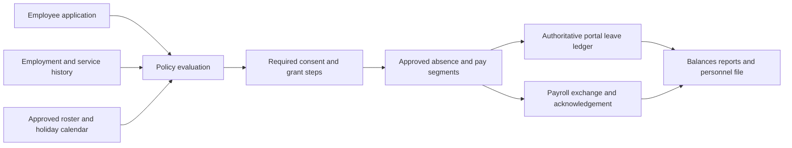

# Government leave policy summary and implementation plan

Date: 6 October 2026

Application: NR ABA portal Leave module

Status: Proposed implementation plan for HR, Chief Secretary, Salary Unit, and technology review

The [build backlog and delivery order](GOVERNMENT-LEAVE-BUILD-BACKLOG-2026-10-06.md) lists the work that can start now, the first implementation package, dependencies, acceptance criteria, and inputs needed before activation.

The [Package 1 structure and 2,000-employee rollout plan](GOVERNMENT-LEAVE-PACKAGE-1-STRUCTURE-2026-10-06.md) records the first local backend implementation and remaining rollout gates. On 6 October the owner specified division approver → Head of Department → Chief Secretary final approval. This enterprise hierarchy must be reconciled with special statutory consents in the source policy; Salary Unit processing follows the final grant.

Extend the existing Leave module into a government-wide service with effective-dated policy rules, employment and service history, a reconciled leave ledger, and approval routes specific to each entitlement. Retain the existing React, Express, and PostgreSQL stack. Establish policy authority, employee identity, and opening balances before expanding access beyond Treasury.

The main implementation risk is incorrect entitlement or approval logic. The current application treats leave as a working-day balance with one approval decision. Government policy also requires event-based grants, different employee categories, service thresholds, shift rosters, multiple authorities, and changes in pay during an absence.

TechnologyOne's Leave module is deferred and is not in service. The portal will operate as the interim leave system for an expected six to twelve months, as confirmed by the application owner on 6 October 2026. The portal owns leave accruals, balances, applications, grants, and the leave audit trail during that period. HR supplies verified employment records and certified opening balances; the Salary Unit continues to own salary calculation, payment, and payroll acceptance. Design a future handover to TechnologyOne if approved, without making a live TechnologyOne integration a condition of this interim release.

The policy document is sufficient to begin implementation and configure many core entitlements. It is not yet sufficient as a single, approved specification for fully automatic government-wide decisions: incomplete precedence rules, category definitions, and several operational details still need signed answers. Build the clear rules now and retain authorised case processing for exceptions until their interpretation is settled.

The application owner selected the three-month initial continuous-service rule for ordinary recreation leave on 6 October 2026. This resolves the portal's general threshold choice; the separate twelve-month temporary-employee recreation rule remains the document's category-specific exception. Teacher recreation remains discretionary. The owner will supply employee IDs exported from TechnologyOne Payroll for the portal's authoritative external employee reference. Deferral of the TechnologyOne Leave module does not prevent using the Payroll export.

## Source and authority

The primary policy source is [GoN Public Service Leave Entitlements HRIS Configuration Reference Updated D](../DEV/GoN_Public_Service_Leave_Entitlements_-_HRIS_Configuration_Reference_UPDATED_D.docx), including the DHRL confirmations dated 22 July and 15 September 2026. It remains labelled a draft for configuration sign-off. Page references below refer to its 23-page render. The file is local reference material in the gitignored `DEV` directory; the relative link requires that local file.

The government HR website publishes a [Public Service Act 2016 compilation](https://nauruhr.gov.nr/wp-content/uploads/2026/03/Public-Service-Act-2016_serv5.pdf). Its amendment table includes Act 33 of 2025, whereas the supplied reference describes amendments through 2022. Section 51(4)(a) still states a three-month initial service test for recreation leave. Section 3 recognises exclusions and inconsistent terms under other written laws. The 2025 secondment provision, s 94A(4), preserves accrued benefits including leave. These findings require targeted legal reconciliation before activation; the compilation does not establish that every later circular or amendment has been incorporated.

Use the September DHRL confirmations where they resolve earlier configuration suggestions. Do not silently resolve conflicts between operating practice and legislation. Store each approved interpretation with its authority, affected population, effective date, and sign-off.

## Interim operating scope

The six-to-twelve-month period is the anticipated operational gap, not a reason to weaken balance accuracy, approval authority, or evidence protection. Configure an independently usable portal with:

- Verified employee and employment records, with imports and corrections controlled by HR.
- One authoritative portal leave ledger, certified openings, local accrual, and service-anniversary grants.
- Type-specific consent and grant stages, plus a restricted assisted-case path for uncommon or unresolved calculations.
- Existing personnel-file PDFs and a reviewed payroll register/export with Salary Unit acknowledgement.
- Department access controls, audit, backups, a restore drill, and a supported correction process.
- Portable exports of employees, service history, balances, pending requests, approved future leave, movements, policy versions, and evidence references for a later HRIS transition.

Keep the current stack and add the necessary domain records incrementally. Defer live TechnologyOne adapters, general-purpose formula editors, and extensive attendance/disciplinary automation. Uncommon event leave, encashment, estate payments, and disputed pay combinations can initially use structured HR cases with recorded legal authority, calculations, evidence, and payroll acknowledgement. Assisted entry records the officer performing the action separately from the applicant and deciding officeholder; it is not permission to bypass a hard eligibility rule or statutory grant authority.

The minimum release must provide a supported process for every entitlement applicable to the pilot population. It can combine automated common leave with properly authorised case processing, without waiting for every rare case to be fully automated. A reassessment near the end of the interim period should decide whether to continue the portal or migrate; do not automatically disable it when twelve months elapse.

## Assessment of configuration readiness

Readiness below distinguishes policy wording from application capability. A policy can be clear while the application still requires implementation and migration. The document contains useful sign-offs, but its draft status and contradictory sections mean it should be consolidated into one approved configuration schedule.

### Material inconsistencies and ambiguities

| Finding | Document location and issue | Configuration consequence and required resolution |
| --- | --- | --- |
| Recreation qualifying service conflict resolved for the portal | Section 6.1 main profile states three months; July DHRL row states employees become eligible after twelve months. Sections 4 and 9 also include a twelve-month temporary rule. Pages 6, 8–9, and 20. | Owner decision on 6 October 2026: use three months for the ordinary covered population, retaining twelve months for temporary employees and discretionary teacher recreation. Separate permission to take leave from accrual commencement. Amend the source schedule to match the selected general rule. |
| Recreation cap terminology | Section 6.1 states three years' annual entitlement and three times the annual entitlement, but July calls it a three-month cap. Pages 8–9. | This is imprecise unit wording rather than proof of two intended caps: four weeks times three is twelve weeks, normally sixty working days. Publish the exact numerical cap in the approved leave unit; do not calculate it as ninety calendar days or three date-based months. |
| Shift conversion is not fully reconciled | Section 3 gives seven paid standard hours per day and proposes actual-hours deduction; September specifies eight-hour non-standard days and eighty hours per fortnight, describing treatment as consistent with standard hours. Pages 4–5 and 22. | Different work patterns may legitimately have different paid hours. The unresolved issue is the conversion and deduction rule, especially for twelve-hour and overnight shifts. Obtain worked examples specifying chargeable policy days and payroll hours. Do not treat the earlier recommendation as the final signed choice. |
| Maternity pay precedence | Section 6.3 says fifth and subsequent pregnancies receive half salary, while reaching six months' service during maternity leave gives full salary for the remainder. Page 11. | Ask which rule applies when both conditions occur and what pay applies before the qualifying date. Record an authorised determination for that combination until precedence is approved. Similar mid-leave eligibility requires a route for paternity/adoption applications beginning before qualification. |
| Probationary category scope | Section 2 defines the ordinary covered population as permanent/contract, but Section 4 lists several probationary entitlements as not restricted. Pages 3 and 6. | Require an explicit matrix for probationary status, substantive employment category, and each leave type. Do not equate silence with automatic entitlement or deny every type with a blanket flag. |
| Teacher recording process | July says timesheet only; September describes a standard PS leave application and Chief Secretary approval. Pages 9 and 22. | These may be complementary steps rather than different entitlements. Define application, grant, timesheet recording, payroll handoff, and who performs each step. Both confirmations agree there is no ordinary accrual formula. |
| Witness approval wording | Section 6.10 says non-Republic witness leave may be granted unpaid; Section 10 describes leave as following automatically for either witness case. Pages 18 and 21. | Distinguish the paid Republic entitlement from the discretionary unpaid case and specify the latter's deciding authority. HOD notification alone should not be treated as automatic grant of both. |
| Long service summary omission | Section 10 presents separation as the only timing, while Section 6.9 also includes Chief Secretary encashment authority. Pages 17 and 21. | Retain separation and encashment as distinct routes. The quick reference needs the exception restored; it does not create permission for unrestricted leave-taking. |
| Superseded open questions remain in the body | Sections 3 and 4 retain unresolved wording subsequently answered in Section 11, including temporary parental applications and shift medical exemptions. Pages 4–6 and 22. | Incorporate September answers into the operative tables and mark superseded proposals. Otherwise different developers can configure different rules from the same document. |
| Legislative baseline is older than the published compilation | Sections 1 and 12 describe a source through 2022; the government-published compilation includes a 2025 amendment and accrued-benefit protection on secondment. Pages 3 and 23. | Update the legislative reference and check relevant amendments/circulars. The difference does not prove all entitlements are wrong, but prevents treating the reference as a fully current consolidated authority. |

The first finding is a source threshold conflict for which the portal's general rule has now been selected; it is no longer an unresolved portal configuration choice. The maternity finding is unresolved rule precedence. The hours and teacher findings need clarification rather than an assumption that either DHRL confirmation is invalid. The summary and superseded-question findings are document consolidation defects. Keep those distinctions in the HR decision register.

### Operational details still needed

These are gaps in the configuration specification, not necessarily contradictions in the policy:

- The payroll accrual anchor, partial-period calculation, internal precision, and year-end reconciliation of the four-week entitlement.
- How LWOP moves service milestones and accrual-year boundaries; historical breaks, transfers, contract renewals, and prior service recognition.
- What counts as consecutive medical absence across off-roster days, and how cancellation/backdating affects the three uncertified single-shift counter. The ten-day entitlement is one pool; three uncertified exceptions are not an additional grant or a reason to restrict certified usage to seven days.
- Entitlement-period allocation for future requests and requests crossing anniversaries, plus allowed forecast accrual, hourly/half-day use, and overlaps.
- How earlier long service usage or encashment affects the ten-year furlough calculation; temporary long service eligibility; and the approved unit for furlough days.
- Current Gazette calendars and authoritative documents/rates for official travel, allowance recovery, and witness fee remittance.
- Actual officeholders, acting assignments, any lawful delegation instruments, evidence reviewers, and the separate role of Payroll in acknowledging an already granted absence.
- The supported government populations and any different written-law regimes, especially where the public service reference is not the complete employment authority.

Ask HR for expected results using real work patterns, with personal details removed. Examples should cover a new permanent/contract appointment, a temporary employee at twelve months, a twelve-hour shift, leave crossing a service anniversary, an LWOP interval, a fifth pregnancy reaching qualification mid-leave, and a person reaching ten years after earlier LSL encashment.

### Rules suitable for initial configuration

The following have a sufficiently clear rule structure to implement now, subject to approved employee coverage, effective dates, and verified inputs:

- Recreation quantum of four weeks, fortnightly accrual, a three-times-annual cap with accrual stopping, fourteen-calendar-day notice hard stop, explicit holiday exclusion, Chief Secretary-controlled cap cash-out, and the owner-selected three-month ordinary service gate. Temporary recreation retains its twelve-month category gate; shift conversion still needs worked examples.
- Medical ten-day and Special three-day appointment/anniversary grants, no carry-over, and temporary access. Medical certificate logic uses a counter inside the ten-day pool; its adjacency edge cases still need examples.
- Permanent-only LWOP, usual twelve-month maximum, study/exceptional extension authority, relevant Secretary consent plus Chief Secretary determination, and employment-end limit.
- Event-based official and witness leave, supporting evidence/tasks, and official allowance recovery within five working days. The unpaid Witness grant route needs clarification.
- Parental event duration, document checklists, notice/discretion routes, adoption backdating, and return tasks. Six-month and pregnancy-count pay combinations need signed case handling before automatic payroll calculation.
- Long service five/eight-year tiers and furlough ten-year trigger plus completed-year increments, with distinct taking-leave, encashment, and separation routes. Certified service history and previous payouts are required before posting amounts.

September has already answered six operating questions: non-standard eight-hour days/eighty-hour fortnights, unpaid meal breaks, shift-based medical exemption counting, current temporary parental exclusion, no current shift holiday compensation/substitute days, and case-by-case teacher recreation. Preserve those answers; request clarification only where their application or relationship to earlier wording remains incomplete.

Before publication, produce a signed configuration schedule with one row per employee-category/leave combination and columns for entitlement, unit, accrual/grant timing, qualifying service, expiry/cap, notice, evidence, authority, pay, exceptions, source, effective date, and worked-example test. Attach a short correction list to the draft rather than asking HR to recreate the whole policy. The signed schedule becomes the portal's configuration authority for the interim period.

## Summary of leave entitlements

Unless otherwise stated, permanent and contract employees are the default population in the reference. Temporary employees have specific extensions and restrictions. Probation, teacher status, roster, and governing employment regime must be recorded separately rather than inferred from a job title.

| Leave | Entitlement and pay | Main conditions and authority |
| --- | --- | --- |
| Recreation or Annual | Four weeks per service year; normally 20 days on a five-day week. Fortnightly accrual confirmed. Cumulative cap of three annual entitlements, normally 60 days; accrual stops at the cap. Full salary. Pro-rata exit payout confirmed. | At least 14 calendar days' notice, confirmed as a hard stop. Relevant Secretary consent followed by Chief Secretary grant. Secretary refusal must be operational and include consultation about an alternative date. Public holidays do not consume the balance. Ordinary initial service threshold: three months, selected by the owner on 6 October 2026. Temporary employees require 12 months. |
| Teacher Recreation | Discretionary period determined by Chief Secretary; no standard recreation accrual formula. | July confirmation specifies timesheet entry. September confirmation describes rare case-by-case applications using the standard PS form and Chief Secretary approval. Capture both the approved case and the timesheet record; confirm their processing order with Education. |
| Medical or Sick | Ten days on appointment and at each service accrual-year anniversary; unused days do not accumulate. Full salary. | Apply through relevant Secretary to Chief Secretary. Up to three non-consecutive single-day absences in the entitlement year can be uncertified; all other usage requires a certificate. For shift workers, the exemption is measured in rostered shifts. Public holidays do not consume medical leave. Temporary employees are included. |
| Extended Medical | Chief Secretary may grant beyond the ordinary ten days, up to three months at full salary for certified medical reasons. Minister may grant a further period up to 12 months at full, partial, or no salary. | Separate case and escalation route, with practitioner evidence and explicit pay determination. Do not force this through the ordinary medical balance. |
| Maternity | Twelve weeks. Six months' continuous service test. Full salary for pregnancies one to four; half salary for pregnancy five onward. The reference also provides full salary for the remaining period if six months' service is reached during leave. | Chief Secretary approval; three months' notice with Chief Secretary discretion for late applications. Certificate states pregnancy, expected birth date, and cessation of duties. Start no later than six weeks before expected delivery unless medically certified fit to continue. Contact Chief Secretary four weeks before leave ends. Same or equivalent position on return, with salary, benefits, and seniority preserved. Temporary applications currently not accepted under September confirmation. |
| Paternity | Two paid weeks after birth or adoption of a child under 12 months. Six months' continuous service test; full salary for the remainder if threshold is reached during leave. | Male employee eligibility in the reference. Chief Secretary approval; three months' notice with discretion for late applications. Expected-birth certificate or certified adoption order, evidence of parenthood, and a follow-up Births Register extract for births. Temporary applications currently not accepted. |
| Adoption | Up to twelve paid weeks per qualifying adoption. Six months' continuous service test; full salary for the remainder if threshold is reached during leave. | Female employee eligibility in the reference; child under 12 months at adoption, excluding spouse's child or step-child. Chief Secretary approval and certified adoption order. Notify intention and apply as soon as practicable. Leave starts from adoption date even if application is later. Temporary applications currently not accepted. |
| Special | Three days on appointment and each service accrual-year anniversary; no accumulation. Full salary; no deduction from recreation balance. | Chief Secretary discretion on sufficient cause. Mandatory justification. Temporary employees included from appointment. The reference does not create a separate five-day Compassionate entitlement. |
| Official | Per approved official trip outside the Republic, with no fixed annual balance. Salary and potentially an allowance at the Minister's rate. | Chief Secretary approval against relevant documents and purpose, as specified by applicable Gazette notices. Temporary employees included for official travel. If travel cannot proceed or be completed, return to work as soon as practicable; allowance returned in full or pro-rata within five working days to HOD. |
| Leave Without Pay | Unpaid approved absence, normally up to 12 months. Longer permitted for relevant study or exceptional circumstances. | Permanent employees only. Chief Secretary determination plus relevant Secretary consent; purpose genuine, justified, and no other leave accessible for that purpose. Cannot exceed employment end date. Temporary and probationary applications prohibited; contract employees excluded by the permanent-only rule. Continuity remains intact but qualifying service pauses during LWOP. |
| Long Service | Twenty working days at five to under eight years of continuous service; forty working days at eight to under ten years. | Chief Secretary grant on contract expiry, retirement, or resignation; primarily a separation benefit. Chief Secretary can allow encashment. Includes contract employees. Do not present it as unrestricted annual leave. |
| Furlough | Sixty days after ten continuous years, plus nine days for each completed additional year. Full pay. | Taking leave requires Chief Secretary and relevant HOD approval. Encashment requires Chief Secretary approval. Includes contract employees. Preserve prior usage and payouts when calculating the remaining entitlement. |
| Witness | Required attendance period. Paid when appearing for the Republic, with duty-travel allowances and expenses if required. Other witness attendance may be granted unpaid. | Prompt HOD notification and court evidence. Republic witness fees other than travel payments must be remitted to the Republic; other witnesses may retain fees. Keep unpaid Witness distinct from permanent-only LWOP. |

Source sections 6.1–6.10, pages 8–18; July confirmation page 9 and September confirmation page 22. Medical extensions and teacher recreation are variants of the statutory categories rather than invented additional annual balances.

For maternity, paternity, adoption, and LWOP, the reference limits leave to the employment cessation date. Parental entitlements are event-based and non-cumulative. Implement weeks as duration rules, separately from rostered work lost and payroll hours; do not use a generic weekday counter to shorten the approved period. Clarify the maternity mid-leave full-pay clause against the fifth-pregnancy half-pay rule before automating that combination.

For long service and furlough, death in service can require a payment to the estate. The reference's special retirement definition includes medical retirement, redundancy, and termination without cause, and excludes misconduct termination. Section 103A's former non-payment restriction is repealed. Obtain HR approval for separation reason and any payable amount; a misconduct exclusion from the retirement definition is not a general rule cancelling every accrued benefit.

## Rules shared across leave types

### Employee coverage

Government-wide deployment does not imply that every government employee has identical legal terms. Create a population register covering public service, Education teachers, foreign service postings, statutory bodies, State-owned enterprises, and any occupations subject to another law or regulation. Assign an approved policy regime to each employment. Do not extend this reference to another population solely because its salary is government-funded.

Temporary employees must retain access to medical, special, and official travel leave, and recreation after the qualifying period. The current blanket ineligibility switch is unsuitable for these distinctions. Temporary long service and furlough treatment remains unaddressed in the reference and requires a determination. Probationary categories also need a signed mapping because the reference's eligibility table and its permanent/contract default are not fully reconciled.

### Temporary employees and interns

Temporary employees are expressly discussed in Sections 2, 4, 6, and 11. Configure medical and Special leave on the same terms as the covered public-service population, official travel eligibility, recreation after twelve months of continuous service, no LWOP, and the September-confirmed exclusion of maternity/paternity/adoption applications until an approved variation. Long service and furlough are not resolved for temporary employees in the reference. Preserve temporary status and its effective changes; reaching a service milestone must not silently recategorise an employee.

The supplied reference contains no intern-specific category or leave entitlement, including in its comments. Intern is a programme or appointment label, not a proven equivalent of temporary, probationary, contract, or permanent employment. Record internship designation separately from legal employment category. HR must identify the appointment terms and applicable regime before assigning leave rules. An unknown category can be imported and reviewed without automatically receiving the permanent rule or having every entitlement denied. The portal's existing intern ineligibility label is an application setting, not evidence that the policy document excludes all interns.

### Service and anniversary calculations

Use a shared service-history calculator for three/six/twelve-month gates and five/eight/ten-year thresholds. LWOP pauses qualifying length without breaking continuity; resignation followed by reappointment breaks continuity. An internal transfer should preserve continuity unless HR records a legally effective break. Secondment must preserve accrued benefits under the published s 94A(4), with sending/receiving organisation assignments recorded separately from the balance owner. Employment category changes must preserve their effective dates.

Medical and Special grants follow the employee's service accrual year, not a general January or July reset. Confirm how the accrual-year boundary moves when LWOP is excluded from service. Represent credited service and employment continuity separately, with documented treatment of unpaid Witness and other unpaid periods instead of assuming every unpaid absence is s 76 LWOP.

### Rosters and units

The reference gives standard attendance of 9am–5pm with an unpaid one-hour meal break: seven paid hours per day and 35 per week. September DHRL confirmation gives non-standard employees eight hours per day and 80 per fortnight, unpaid meal breaks, and medical certificate exemptions measured in rostered shifts.

Store policy days and scheduled/payable hours separately. Recommend exact decimal policy-day balances with a work-pattern conversion, rather than one global seven-hour conversion. A standard 20-day recreation entitlement corresponds to 140 paid hours; if HR confirms 20 eight-hour policy days for the non-standard population, it corresponds to 160 hours. The latter is a configuration interpretation that needs a worked-example sign-off, especially for 12-hour and overnight shifts. The early recommendation to deduct actual shift hours is not itself the confirmed rule.

Published rostered weekends are potential leave days; an off-roster weekday is not automatically a leave day. Require approved roster coverage for every requested date. Missing roster data must produce a clear validation result, rather than silently falling back to Monday–Friday. Half-day or hourly requests should remain disabled until policy defines their allowed use and conversions.

### Holidays and absence

Maintain an annually approved Gazette calendar with provenance, actual and observed dates, substitutions, and version history. The listed days include 1 January, 31 January, 1 February, Good Friday, Easter Monday and the next Tuesday, 17 May, 26 October, 25 December, and 26 December, plus declared holidays.

The reference has special weekend rules: ordinary weekend holidays move to Monday; weekend Independence Day creates Monday and Tuesday holidays; Sunday Christmas moves to Tuesday; Saturday Christmas creates Monday and Tuesday substitutes for Christmas and Boxing Day. Resolve collisions from the approved annual calendar rather than applying a generic next-business-day rule.

Recreation and medical holiday exemptions are explicit. Do not apply them to every other entitlement without authority. September confirmation gives rostered officers no current holiday compensation or substitute day; this does not remove the recreation/medical holiday exemptions. Newly declared holidays affecting approved leave need controlled recalculation, ledger adjustments, and payroll reconciliation.

AWOL is an attendance exception, not a selectable leave entitlement. It requires absence during required hours and no granted leave. Retrospective cure requires prompt notification, prompt application, and subsequent approval. Record all three facts. The reference gives no pay for AWOL and a deemed-resignation provision after 14 continuous days without required notice, with six-month reemployment restriction. Raise a time-sensitive HR/legal case using verified attendance and notices; do not terminate employment automatically from a missing application or failed roster import.

## Decisions needed before policy activation

| Decision | Evidence and implementation effect | Owner |
| --- | --- | --- |
| Recreation eligibility selected | Use three months for ordinary recreation leave, as directed by the owner on 6 October 2026. Retain the separate twelve-month temporary rule and teacher discretion. Record category scope and effective date in the published schedule; correct the conflicting general July wording. | Portal owner, DHRL |
| Approval delegation | July explicitly says HOD delegation is unresolved and may require legal change. Keep Secretary consent and Chief Secretary grant distinct until an authorised instrument is supplied. | Chief Secretary, legal adviser |
| Interim ownership and payroll exchange | Portal leave ownership is confirmed for the six-to-twelve-month gap. Confirm HR's employee source and Salary Unit's approved register/export, acknowledgement, and correction procedure. TechnologyOne handover is a later decision. | DHRL, Salary Unit, portal owner |
| Shift charging | Obtain standard, eight-hour, 12-hour, overnight, weekend, and holiday examples; resolve the seven-hour/eight-hour distinction and policy-day conversion. | DHRL, roster owners, Salary Unit |
| Medical evidence | Define non-consecutive absence handling across off-roster days and entitlement boundaries; validate that ten certified days can be used from the full entitlement. | DHRL |
| Parental pay and eligibility | Determine mid-leave threshold treatment, fifth-pregnancy interaction, event duration, employment end dates, and signed probationary mapping. Retain September's temporary exclusion until variation. | DHRL, Chief Secretary, Salary Unit |
| Service boundaries | Confirm LWOP-adjusted anniversaries, partial months, leap days, reappointment, contract renewal, overseas postings, and other unpaid periods. | DHRL |
| Long service transition | Determine reconciliation of prior LSL encashment at the ten-year furlough threshold; avoid double benefits without inventing a forfeiture rule. Confirm day units. | DHRL, Salary Unit |
| Existing local types | Establish authority for Compassionate five days, Special five days, study absences, and manual balances. Map or retain approved exceptions by regime. | DHRL, Treasury HR |
| Operations and records | Agree population scope, medical-document readers, retention, appeal/rectification process, attendance evidence, recovery objectives, and employee support. | HR, ICT, records owner |

The six September confirmations are already answers, not six wholly unanswered questions. Register them with their source and effective-date approval. Resolve only remaining ambiguities and implementation examples. Preserve the July wording describing the cap as “3-month” alongside the explicit three-times-annual formula; configure the signed numeric rule rather than treating three calendar months as interchangeable with twelve weeks.

## Current application assessment

Reviewed local checkout `5c576d1` dated 5 October 2026. Code findings describe this checkout, not deployed data or configured production policy. Graph generation `2026-10-05T21:50:19Z` had matching coverage metadata for the relevant code paths, with no recorded parse gap. The excluded policy document was read directly. Graph coverage is best-effort and is not a completeness guarantee.

| Existing component | What to retain | Change required |
| --- | --- | --- |
| `app/backend/src/services/leaveService.js` | Transactional application, pending holds, cancellation, self-approval prohibition, supporting files, approval-time PDF snapshot. | `applyForLeave` checks one global eligibility flag and requires available balance for every type. `decideLeave` records one final reviewer. Introduce type-specific evaluation, event grants, workflow steps, and postings by entitlement period. |
| `app/backend/src/services/leaveAccrual.js` and `lib/accrualRules.js` | Separate calculation functions, configured fortnight anchor, run history, cap handling, reset support, existing tests. | Accrual loops through currently active entitled staff and credits a fixed type-wide rate. Add effective employment history, partial periods, LWOP, employee-specific rules, precise accrual, and recoverable jobs. Fixed two-decimal rates can drift from annual entitlement. |
| `app/backend/src/db.js` | Existing employee, organisation, application, balance, attachment, adjustment, and holiday tables. | Seeds include Special 5, Compassionate 5, and medical 7/3 pools. Types default to no reset and a new type's accrual rate defaults to zero. These are seed definitions, not verified live settings. Introduce approved mappings and migrations rather than overwriting production configuration. |
| `app/backend/src/routes/hr.js` | API integration points, PDF access checks, staff administration, imports, overview, calendar, and reports. | Staff-manage access to `/employees` and `/report` is government-wide within this database. Add department scopes, authority assignments, pagination, stable employee identification, and separate payroll/evidence permissions. |
| `app/backend/src/lib/leaveDates.js`, client `apps/leave/types.ts`, report SQL | Date-only intent and existing holiday-aware arithmetic. | All use weekday assumptions, and holiday removal currently applies generically. Replace independent arithmetic with server evaluation and persisted day-level results. |
| `app/client/src/apps/leave/sections/MyLeave.tsx`, `Approvals.tsx`, `Policies.tsx` | Established self-service, evidence upload, queues, policy administration, and PDF flow. | Add conditional forms, eligibility explanations, event leave, stage-specific approval, and controlled policy publication. Current approval messaging describes Treasury as final; general rollout requires policy-specific authority. |

Specific correctness issues to address before rollout:

1. One medical balance must support up to ten certified days, with the three uncertified days as an exception counter within that ten. Separate seven/three wallets can incorrectly reject someone with no uncertified absence who needs eight certified days.
2. `balanceYearFor` charges an entire request to its starting calendar year. Replace this with entitlement-period allocation, including anniversaries and pay periods crossed during one absence.
3. `ensureBalance` reads an existing balance without a row lock, and approval subtracts without an explicit sufficiency recheck. Test and enforce atomic reservations and final postings under concurrent applications, adjustments, and resets. A transaction and an application-row lock alone do not serialize competing applications against the same balance.
4. `currentEmployee` automatically links a unique normalised name match or creates an employee on access. Names are insufficient proof of employee identity for national HR records; use verified staff/payroll identifiers and a controlled claim process.
5. Reporting recomputes weekdays from today's calendar, while approved `days` remain stored. A later calendar change can make reports disagree with historical deductions. Report from approved segments and authorised corrections.
6. Policy edits change a shared type record in place. Previously approved requests need their original rule version and calculations preserved.

The backend now has `npm test` and `npm run test:db`, plus leave-service and accrual integration tests. The older repository guide's statement that backend tests do not exist is stale. Extend these test suites. Historical items in `HR-HARDENING-PLAN.md` also need checking against current code before being treated as completed safeguards.

## Recommended application design

### Keep a modular application

Continue using React/Vite, Express, and PostgreSQL. Group leave policy and workflow into a module behind the existing `/api/hr` facade, with new feature routers and services following repository conventions. Introduce these responsibilities incrementally:

| Proposed responsibility | Purpose |
| --- | --- |
| Policy evaluation | Given employee, leave event, dates, roster, calendar, and rule version, return eligibility, explanations, document requirements, charging segments, pay segments, and approval route. |
| Service history | Compute continuity and credited length from effective-dated employment and excluded intervals. |
| Ledger and reservations | Post grants, accrual, usage, expiry, encashment, corrections, and reversals; hold pending requests without duplicating usage. |
| Workflow | Create required consent/grant steps, resolve lawful officeholders, record decisions and delegation, and complete only when every required step is satisfied. |
| Cases and follow-up tasks | Track parental events, extended medical decisions, return reminders, teacher approvals, official trip recovery, witness remittance, and reviewed attendance exceptions. |
| Payroll and HRIS adapter | Exchange approved pay/leave changes, track acknowledgements, and reconcile authoritative systems. |
| Reporting | Read approved segments and reconciled ledger projections using department scopes and consistent date windows. |

Use typed, validated policy parameters and explicit calculation strategies. Avoid arbitrary executable formulas stored in the database. Each rule version needs scope, source section, approved interpretation, effective interval, owner, sign-off, and status. Keep drafts separate from published rules; prevent ordinary administrators from changing national entitlements with an unrestricted edit.

The evaluator produces a calculation; the required officeholders grant the leave. Balance-backed types use portal reservations and ledger postings, while event-based types use approved case limits and pay segments. During the interim period, the portal is authoritative for leave and exchanges approved effects with the Salary Unit. A future TechnologyOne handover changes ownership only after reconciliation and an agreed cutover.

### Employment and organisational records

Keep person identity separate from employment episodes and login identity. Add a unique authoritative staff/payroll identifier; effective employment category and policy regime; appointment, credited-service, probation and contract dates; teacher designation; work-pattern assignments; position and department/division IDs; manager and statutory office assignments; transfer and separation events; and rates effective for each payroll period.

### TechnologyOne Payroll employee ID import

Use the forthcoming TechnologyOne Payroll export as the external employee-reference source. Retain the portal's internal UUIDs and store the exported ID in a separate text field, for example `payroll_employee_id`, with source-system provenance and validated uniqueness for the relevant payroll population. Preserve leading zeros, letters, and exact formatting; do not convert IDs to numbers or use names as the primary import key. Confirm whether IDs remain stable on reappointment and whether multiple payroll/employment records can refer to one person before enforcing a person-level uniqueness constraint. Retain an employment episode or source-assignment key where required.

The useful import fields are employee ID, full name, department, division, position, employment category, active/inactive status, initial appointment date, credited continuous-service date or supporting history, and contract/end date where applicable. Work pattern, official email, and supervisor employee ID are useful additional fields. Distinguish an original public-service appointment from a recent department transfer or payroll-system commencement date: these dates cannot automatically substitute for qualifying service. Bank accounts and tax identifiers are unnecessary for this leave-identity import.

Accept a controlled CSV or XLSX extract with IDs represented as text. Validate required IDs, duplicates, category mappings, dates, supervisor links, and existing-record matches; present a dry-run reconciliation before writing. Match existing portal employees through reviewed ID assignments first, never automatically merge equal names. Store an import batch ID, export date, source row/reference, and change audit; repeated imports update matching records without duplicating employees or overwriting leave balances. Linking a portal login to an imported employee requires HR verification or a controlled identity claim, not possession of a payroll ID alone.

A manager relationship is not proof of authority to grant leave. The ordinary operational chain is division approver → Head of Department → Chief Secretary final approval, as directed by the owner. Maintain dated organisation-scoped officeholders and additional assignments for relevant Secretary/Minister consents and Payroll handling. Delegations require instrument reference, allowed actions, population, effective dates, revocation, and conflict-of-interest handling. Support acting officeholders without editing historical approvals.

### Proposed data model

These are responsibilities and candidate tables, not a requirement to add every table in the first release:

| Record | Core contents |
| --- | --- |
| Employment episode and assignment history | Staff ID, regime/category, start/end, continuity group, credited intervals, organisation, roster, rate. |
| Policy versions and regimes | Stable leave code, strategy, eligibility, duration, reset/cap, notice, evidence, pay and route configuration, sources and effective dates. |
| Work patterns and roster days | Employee/date, published shift, local start/end and overnight span, payable hours, policy-day charge. |
| Holiday calendar versions | Actual/observed date, Gazette authority, publication and supersession, applicability by location/regime. |
| Leave entitlement periods | Employee/type, exact period boundaries, opening/grant, service basis, governing version. |
| Leave ledger and reservations | Signed amount, unit, event kind, period, application/case, idempotency key, effective/recorded dates, actor, correction/reversal reference. |
| Application segments | Date or shift, duration, charge, holiday exemption, entitlement period, roster/calendar version, salary fraction, payroll period. |
| Approval steps and authority assignments | Required action/office, decision, reasons, deciding identity, instrument and officeholder snapshot. |
| Leave cases and evidence | Qualifying event, restricted facts, typed evidence and verification, document access, follow-up tasks. |
| Payroll batches and outbox | Export version, leave/pay segments, external references, delivery attempts, acknowledgements, correction and reconciliation state. |

Extend applications with stable type code, event/case reference, policy and calculation snapshots, submission version, stage, and final grant status. Keep existing approved records immutable and printable. Use a projection of the ledger for fast balances; corrections create postings rather than rewriting history. Do not seed event types with fake large balances to bypass the current balance check.

Follow the current idempotent `initSchema` pattern for additive schema changes. Track one-time backfills with unique migration markers. Run large backfills explicitly outside API startup and use an expand/backfill/cutover approach. Preserve existing tables and identifiers until reconciliation and compatibility checks permit retirement.

### API and frontend behaviour

Add a server-side evaluation endpoint for drafts. It returns eligible types, exact duration/charge, remaining and projected balances, salary effects, evidence checklist, validation failures, required offices, and source references. The same evaluator runs on submission and final grant. If roster, policy, employment, or calendar changes materially affect the preview, require a refreshed calculation and appropriate review; never trust client-supplied charges or pay rates.

Use a submission idempotency key, deterministic balance-lock order, and unique ledger event keys. Pending holds may cross several entitlement periods. Release them once on rejection/cancellation and consume them once on grant. Future-dated requests need an agreed rule for forecast accrual and expiring entitlements; do not reserve today's medical allowance across an anniversary by accident. Allow approved amendments and cancellations through explicit reversal and payroll-correction workflows, with their own authority.

Employee screens should show balance-backed leave separately from event entitlements and explain eligibility dates. Forms request only relevant event details: expected birth/adoption date, trip purpose, witness status, or medical evidence. Managers see coverage and absence duration; authorised HR reviewers see restricted evidence. A timeline shows consent, grant, payroll acknowledgement, and return tasks as separate events.

HR screens need effective employee records, decision-log and policy publication, roster/calendar validation, balance reconciliation, cap actions, and exception cases. Payroll screens need pay-period segments, salary fractions, encashment and allowance recovery, export acknowledgements, and amendments. Preserve personnel-file PDF output with a versioned approval and calculation snapshot and approved visibility of sensitive reasons.

## Access and operational design for all departments

Use one government deployment initially, with department/division scopes and a small number of centrally authorised cross-government roles. Centralised administration does not justify giving every departmental staff manager visibility of everyone. Enforce scope on individual records, lists, attachments, PDFs, bulk imports, exports, reports, and background tasks. Test against guessed UUIDs and cross-department access.

Separate staff management, medical evidence review, statutory grant, payroll export, policy publication, and audit access. Keep confidential reasons out of team calendars, routine emails, analytics, and logs. Log sensitive document access and record changes. Protect certificates and parental facts with restricted access, encrypted storage/backups, controlled retention, safe file validation and malware screening. Invalidate access promptly when assignments or sessions are revoked; require stronger authentication for privileged roles.

Start capacity testing at the reference's 2,000-plus employee population, and a synthetic 5,000-employee scenario for headroom, including several years of applications. These are test assumptions, not measured government headcount. Paginate staff and queues; bound calendar/report date ranges; index scoped access and ledger lookups; queue long exports. Replace nested accrual SQL with batched or set-based processing after correctness is pinned by tests.

Accrual jobs need locking, per-employee/type/period idempotency, progress and failure records, retry, and reconciliation totals. A run-level unique period alone is too coarse for correcting one person's historical accrual or adding a newly covered population. Use historical employment state for catch-up, not today's active flag. Retain sufficient internal precision to reconcile each service year to its exact entitlement; do not assume rounding `20 / 26` to two decimals yields 20 days or that every year has exactly 26 payroll runs.

Use a transactional outbox for notification and integration delivery so accepted requests survive email or HRIS outages. Monitor stuck queues, missing accruals, negative balances, unacknowledged payroll batches, cap cases, missing officeholders, and roster gaps. Agree support ownership, account recovery, backup recovery point/time targets, restore testing, incident response, and a signed paper/assisted-entry fallback. Staff without reliable email or phone access need an authorised assisted application path with an actor/applicant audit trail.

## Interim payroll exchange and future TechnologyOne handover

During the six-to-twelve-month interim period, the portal runs leave accrual and maintains the authoritative leave subledger. The Salary Unit must acknowledge approved usage, unpaid periods, partial-pay segments, payouts, and corrections against stable staff and event identifiers. TechnologyOne Payroll employee IDs will provide the external employee reference, as confirmed by the owner on 6 October 2026. Confirm the Salary Unit's accepted exchange format and acknowledgements; use of a Payroll export does not require activating the deferred TechnologyOne Leave module.

Start with a versioned payroll register/export and a controlled acceptance process if a live payroll interface is unavailable. Keep delivery state, batch totals, acknowledgements, and corrections in the portal. A signed manual acknowledgement is acceptable for an interim exchange provided every batch and amendment can be reconciled. Live TechnologyOne integration is deferred work, not an interim activation gate.

Prepare the handover export from the start: employee identifiers, employment/service exclusions, dated balances and ledger movements, medical exception counters, previous LSL/furlough payouts, approved future leave, pending reservations, policy versions, approval evidence, and attachment references. When TechnologyOne is approved, map its fields, rehearse import, reconcile by employee/type, agree treatment of in-flight requests, freeze writes briefly, and disable portal accrual at the agreed cutover. Retain the portal history read-only for authorised audit access under the agreed retention schedule. Never leave both engines posting accrual for the same employee/type/period. TechnologyOne's import/API requirements remain to be discovered at that stage.

Leave approval and payroll delivery are different states. Calculate maternity half-pay and threshold changes as dated salary segments; track official allowance recovery and witness-fee remittance as financial tasks. For encashment, prevent both duplicate payment and reuse of committed leave while payroll acknowledges the transaction. Payroll rejection must generate a visible reconciliation case. Do not generate an ABA payment directly from an ordinary leave approval.

## Migration and reconciliation

1. Inventory deployed rules, employee categories, balances, pending applications, adjustments, accrual anchor, roster sources, pay rates, HR employee sources, and Salary Unit payroll exchanges. Restrict exports to authorised staff and avoid copying identifiable production data into development.
2. Obtain a signed population and policy matrix. Assign authoritative employee IDs and resolve duplicate/name-linked records through HR verification. Preserve the former IDs and audit provenance.
3. Map stable codes while retaining historical leave-type IDs and labels. Merge the two sick pools into one medical allowance with evidence history and an uncertified counter; preserve historical totals and flag incompatible cases. Do not silently discard Compassionate or reduce existing Special balances without an approved transition decision.
4. Establish opening balances at one agreed cutover date, signed by HR and Salary Unit. Preserve existing approved and future leave, reservations, usage, expiry, prior LSL/furlough payouts, and service exclusions. Reconstruct from trusted records only; otherwise record a certified opening balance with provenance and unresolved exceptions.
5. Produce a dry-run comparison per employee and type: opening, movements, holds, closing, and payroll effect. Quarantine exceptions; aggregate agreement alone can hide offsetting employee errors. Rehearse the import on a restored test database.
6. Shadow the new evaluator and accrual over two representative payroll cycles. Explain every difference against signed cases, including anniversary and event cases outside those cycles. Keep only one engine posting real accrual.
7. Freeze relevant writes briefly, apply additive migration and certified openings, import pending holds, switch the feature flag for the pilot population, and reconcile immediately. Retain old records read-only. Rollback restores routing/read behaviour; posted financial changes require controlled reversals and payroll reconciliation rather than deleting ledger history.

## Implementation phases and acceptance gates

| Phase | Deliverables | Required gate |
| --- | --- | --- |
| 0 Policy and interim operations | Correction/decision register, regime/category matrix, approved routes/delegations, roster examples, HR source, Salary Unit exchange contract, cutover sources. Portal leave ownership is confirmed. | HR/CS/Salary Unit sign off scope and rules; disputed combinations require authorised case determination. |
| 1 Core records and controls | Stable identities, employment/service history, organisational scopes, effective policies, ledger and locks, migration dry run. | Cross-department access and concurrent posting tests pass; certified openings reconcile. |
| 2 Recreation Medical and Special | Fortnightly accrual/cap actions, anniversary grants, evidence counters, holiday/roster calculation, staged authorities, new application UI and PDF snapshots. | Approved policy cases pass; no balance or reporting drift; pilot payroll exchange reconciles. |
| 3 Event and extended leave | Parental events/pay segments, extended medical, official trips, LWOP service pause, witness variants, teacher case/timesheet workflow. | Document, notice, authority, duration, and payroll scenarios signed by HR; each enabled population has supported leave paths. |
| 4 Long service and financial cases | Five/eight/ten-year thresholds, prior-payment reconciliation, furlough use, encashment, separation/estate cases, reviewed attendance exceptions. | Service-history and payout cases reconciled; Salary Unit acknowledges exports and corrections. |
| 5 Rollout and operations | Representative pilot, performance/accessibility checks, restore drill, training, support and fallback, wave controls. | Two reconciled payroll cycles plus representative boundary cases; no unresolved critical defects or policy gaps for the next cohort. |

For the interim release, prioritise Phases 0–2 and the structured case/evidence/payroll path needed to support applicable event and financial leave. Phases 3–4 describe the full automation target, rather than a requirement to automate every rare calculation before a pilot. Every cohort must have an authorised, auditable process for all its applicable entitlements. Case handling must record the decision and protect its posting from duplicates and unauthorised changes.

Pilot with standard office staff, rostered health/security staff, Education teachers, temporary and contract staff, approvers, and Salary Unit. Expand by departments only after each wave's identities, authorities, roster calendars, and opening balances are ready. Report usage, queue aging, support issues, and payroll exceptions by cohort.

The earlier twelve-to-eighteen-week allowance describes the broad automation programme, not a prerequisite for the first interim release. Re-estimate the core pilot after Phase 0 using existing portal capabilities, verified data, the agreed payroll export, and structured handling of uncommon cases. Prioritise useful operation early in the six-to-twelve-month gap; avoid consuming most of a short interim period building features that can be safely supported by authorised cases. TechnologyOne adapter delivery is outside this interim schedule. Data reconstruction or legal changes may still constrain particular populations; correctness and reconciliation gates determine readiness.

## Verification scenarios

Extend existing backend unit and real-PostgreSQL suites and frontend tests. Verify browser flows on desktop, narrow/mobile screens, and keyboard navigation. Include these material cases:

| Area | Required evidence |
| --- | --- |
| Eligibility | Category-by-type matrix, temporary medical/special access, LWOP exclusion, teachers, contract end date, documented service thresholds, and policy-effective-date transitions. |
| Recreation | 14-day accepted versus 13-day rejected; exact annual reconciliation; partial appointment/pay periods; cap stops without deleting excess; CS cap direction and cash-out constraints; exit pro-rata. |
| Medical | First three non-consecutive single shifts without certificate; fourth requires it; consecutive shifts require it; eight or ten certified days allowed from ten; cancellation restores counters correctly; anniversary reset; extended routes. |
| Parental | Six-month threshold before/during leave, correct pregnancy pay count, expected-birth start rule, late-notice discretion, adoption age/relationship and backdating, reminders, and employment-end limits. |
| Service and LSL | LWOP pauses rather than resets, transfers preserve signed continuity, resignation/reappointment breaks it, leap-day anniversaries, five/eight/ten-year boundaries, earlier payouts, and completed-year increments. |
| Roster and holidays | Standard/eight-hour/12-hour examples, overnight shifts, off-roster days, weekend work, Independence/Christmas substitution, declared holidays after approval, and location-specific calendars if overseas staff are included. |
| Workflow and concurrency | Every required authority acts, delegation expiry, self-approval blocked, two competing requests, adjustments during approval, request retries, cancelled/rejected holds, cross-period holds, and final-grant revalidation. |
| Payroll and audit | Pay-period split, partial salary, encashment commitment/acknowledgement, failed and retried export, reversal after payroll, immutable PDF snapshot, and balances/reports/export reconciliation. |
| Security and operations | Department scope on all resources, confidential evidence visibility, verified login linkage, revocation, unsafe upload rejection, job restart/double-run/catch-up, representative load, and restored records/documents. |

Example policy acceptance cases: ten scheduled recreation days containing two eligible public holidays charge eight; an employee with ten medical days can take eight certified days; temporary medical leave is available even where temporary recreation is not yet available; an LWOP interval moves credited-service milestones without breaking the employment continuity group. HR must provide expected outputs for each roster and disputed-rule case.

## Recommended first implementation package

Start with Phase 0 and the foundation for Phase 1: signed policy corrections, HR employee sources, Salary Unit exchange, authoritative employee IDs, organisational scope, employment history, effective rule versions, ledger/reservation invariants, and migration rehearsal. Portal leave ownership for the interim is settled. Then implement high-volume recreation/medical/special routes and the authorised case path on that foundation.

Keep the current personnel-file PDF and transaction behaviour while evolving the module. National rollout should begin only when the supported employee population, legal grant authority, reconciled payroll outcomes, and handling of every applicable entitlement are explicit. Full automation of uncommon cases can follow during the interim period; their authorised processing and operational support are required from the first supported cohort.
